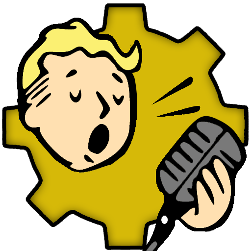

<br />
<div align="center">
  <a href="https://github.com/FallTalk/FallTalk/blob/main/resource/falltalk.png?raw=true">
    
  </a>

  <h3 align="center">FallTalk</h3>
</div>

# Introduction

Hello and Welcome to FallTalk, the Open Source Text to Speech (TTS) and Voice Cloning Software for Fallout 4. So, why did I create this? Originally, this began as a fun little project to understand how AI works, which could further my career as a software engineer. One day while playing Fallout 4, I encountered a mod with absolutely terrible AI voices. This sparked an idea: what if I combined my project to understand AI and provided the community with a way to create better AI voices?


The main question I've been asked so far is: Why create this when ElevenLabs and xVASynth already exist? The answer is simple: I am convinced that the audio quality produced by this tool can rival that of ElevenLabs, and in some instances, it can even surpass. Most importantly, it's free for everyone. 

For those who favor ElevenLabs, this tool is seamlessly integrated, enabling the use of RVC-trained models with any of ElevenLabs' TTS options if you possess an ElevenLabs account. I am confident that this represents the next evolution in TTS technology for Fallout modders.

This tool will allow you to accurately clone voices from various characters, including the Eyebot, Polymer Labs Announcers, Mr. Gutsy, Liberty Prime, and more. Really, it can accurately clone every voice, from the elevator sounds to the protagonist. These are bold claims, and I have provided audio samples below for your evaluation. 

FallTalk does not contain any assets from Fallout 4, but they were used to train the models. The tool will look for your Fallout 4 directory to use reference audio files.

# Support

All the models and software have been trained from my personal computer. This is not exactly quick, so I would love any and all support. From training new models, testing, submitting bugs, or making pull request. Also being able to get a 4090 would go a long way for training bigger models.
- [Discord](https://discord.gg/FgKrxdnQdG)
- [KO-FI](https://ko-fi.com/bryant21)
- [GitHub](https://github.com/falltalk/falltalk4)
- [Nexus Mods](https://www.nexusmods.com/fallout4/mods/86525)

  
# How to Use

The goal for the app was to make it easy to understand, but let's break down a few key terms:

- **Engine**: This is the back end open source engine that can be used to generate the audio. You can quickly change engines by selecting one from the drop down bar about
- **Model**: A "model" is a file that contains the data the AI needs to generate the voice. In the FallTalk app, we call them "Characters" for simplicity. Characters can be downloaded, updated, or deleted from the main selection panel. an "untrained"  character means that the engine will do its best job to make the voice, but it was not specifically trained on that character. Even when untrained on an engine, you can get good results if the character has a RVC model.
- **Device**: You can generate using GPU or CPU to make the voice. CPU is great because it allows you to run games and not take away from your resources 
- **RVC**: Retrieval-based-Voice-Conversion is the secret sauce. You can use RVC your microphone on any of the models to turn you into that character. The issue comes when you are the opposite generate, which is why we have the other TTS engines. After the TTS generates audio, we can apply the RVC model on top of the generated audio. Think of it as an audio upscaler when used this way, it just makes the audio sound better.
- **Reference Audio**: Reference audio is a sample of voice used by TTS models to mimic or clone specific vocal characteristics during audio generation. Basically, it tries to match the speed, cadence and overall sound of the reference piece. If you pick a reference audio that is a whisper for example, it will greatly change the generated audio. You can select multiple reference audio files. Each engine has its own requirements for reference audio:
  - **GPT SoVITs (Fine Tuned)**: Minimum of 1 second of reference audio, but recommended at least 3. Selecting Multiple references can lead to a better result, assuming they all sound similar.
  - **GPT SoVITs (Untrained)**: 3-10 seconds. More than 10 seconds can lead to hallucinations.
  - **VoiceCraft**: 3-16 seconds. Can work with longer, but can consume too much VRAM.
  - **XTTSv2**: 10-15 seconds. Can give back hallucinations with less than 10 seconds, but does sometimes work. Selecting Multiple references can lead to a better result.
  - **StyleTTSv2**: 5-10 seconds.

Why did I implement so many engines? Well, because they all have strengths and weaknesses.

- **RVC**: Voice Cloning using your own voice! This allows you to achieve better results in some cases, as you can mimic the original cadence and speech patterns. It's basically magic.
- **GPT SoVITs**: Extremely fast and easy to train, making it a great all-rounder. Made from the same team as RVC so they work well together.
- **VoiceCraft**: Offers something nothing else does: Audio Editing. This allows you take an existing audio file and tweak it slightly. Want to replace "minutemen" with "NCR", well this is the model to do it. Requires a powerful graphics card to run.
- **XTTSv2**: Offers decent quality, though it may sometimes lack emotion. It excels at generating large amounts of text, making it ideal for narration or long speeches.
- **StyleTTSv2**: Incredibly fast and, as the name suggests, is designed to mimic the tone and style of reference audio. It is often considered the best in the text-to-speech space, but requires a high-end GPU like the RTX 4090 (or two) for fine-tuning a voice. I added it mostly because I want to train it in the future.

The FallTalk program has the framework to add or remove more engines as needed. The only real limit is making sure everything runs on the same python versions. 

# Tips and Tricks

- **Text Length**: If you want to generate small phrases, sometimes you will need to "pad" your prompt with extra text. This often happens if the generated audio is shorter than the reference audio. So you can try and generate multiple phrases at once, or just put some generic padding phrase.
- **Reference Audio**: Be sure to try multiple reference audios to get a different effect. They can change speed, rhythm, emotion, and much more.
- **Trial And Error**: Not happy with how something sounds? Move a slider and regenerate. Rinse and repeat until you get something that matches what you are targeting more closely. Mess up and it's gibberish? Just reset the settings.
- **Updates**: New models may be released that are better or trained more thoroughly than what was initially released. The main character page will have an update button, and with a single click you can download the new model. Also, as new versions of the apps are released, you will be notified in the main toolbar, but these cannot be auto downloaded at this time.
- **Laughing / Emotions**: Some of the engines will respond correctly if you do this things like "haha" "hmm" "heh" etc.


# Audio Samples

| Source | ElevenLabs | GPT_SoVITS | RVC |
|--------|------------|------------|-----|
| [Nate (Protagonist)](https://github.com/FallTalk/FallTalk/raw/main/samples/00067fdf_1_nate.wav) | [00067fdf_1_elevenlabs](https://github.com/FallTalk/FallTalk/raw/main/samples/00067fdf_1_elevenlabs.wav) | [00067fdf_1_gpt_so_vits](https://github.com/FallTalk/FallTalk/raw/main/samples/00067fdf_1_gpt_so_vits.wav) | [00067fdf_1_rvc](https://github.com/FallTalk/FallTalk/raw/main/samples/00067fdf_1_rvc.wav) | 
| [Mr Handy](https://github.com/FallTalk/FallTalk/raw/main/samples/00157a55_1_mr_handy) | [00157a55_1_elevenlabs](https://github.com/FallTalk/FallTalk/raw/main/samples/00157a55_1_elevenlabs) | [00157a55_1_gpt_so_vits](https://github.com/FallTalk/FallTalk/raw/main/samples/00157a55_1_gpt_so_vits.wav) | [00157a55_1_rvc](https://github.com/FallTalk/FallTalk/raw/main/samples/00157a55_1_rvc) |
| Mr Handy |[MrHandy_HelloThere_elevenlabs](https://github.com/FallTalk/FallTalk/raw/main/samples/MrHandy_HelloThere_elevenlabs.wav) | [MrHandy_HelloThere_gpt_so_vits](https://github.com/FallTalk/FallTalk/raw/main/samples/MrHandy_HelloThere_gpt_so_vits.wav) | [MrHandy_HelloThere_rvc](https://github.com/FallTalk/FallTalk/raw/main/samples/MrHandy_HelloThere_rvc.wav)
| [EyeBot](https://github.com/FallTalk/FallTalk/raw/main/samples/00144f9c_1_eyebot.wav) |[eyebot_eleven_labs](https://github.com/FallTalk/FallTalk/raw/main/samples/eyebot_eleven_labs.wav) |  [eyebot_gpt_so_vits](https://github.com/FallTalk/FallTalk/raw/main/samples/eyebot_gpt_so_vits.wav) | [eyebot_rvc](https://github.com/FallTalk/FallTalk/raw/main/samples/eyebot_rvc.wav)

And since I ran out of voices, here are some other random samples:

| Character | GPT_SoVITS                                                                                                           | RVC | 
|--------|----------------------------------------------------------------------------------------------------------------------|------------|
| Sentry Bot | [sentrybot_gpt_so_vits](https://github.com/FallTalk/FallTalk/raw/main/samples/sentrybot_gpt_so_vits.wav)                                                                                                                     | [sentrybot_falltalk_rvc](https://github.com/FallTalk/FallTalk/raw/main/samples/sentrybot_falltalk_rvc.wav)
| Protectron | [welcometomegaton_gpt_sovits](https://github.com/FallTalk/FallTalk/raw/main/samples/welcometomegaton_gpt_sovits.wav) |   [welcometomegaton_rvc](https://github.com/FallTalk/FallTalk/raw/main/samples/welcometomegaton_gpt_sovits.wav)
| Preston | [preston_another_settlement_gpt_so_vits](https://github.com/FallTalk/FallTalk/raw/main/samples/preston_another_settlement_gpt_so_vits.wav) | [preston_another_settlement_rvc](https://github.com/FallTalk/FallTalk/raw/main/samples/preston_another_settlement_rvc.wav) |
| Cait | [Reddit Meme](https://github.com/FallTalk/FallTalk/raw/main/samples/cait_reddit_pasta_nsfw.wav) | Note: I really like how it changes "my" to "me" and so forth to match her accent


# Getting Started

The first step is to download and install [Microsoft Visual C++ 2010 Redistributable](https://learn.microsoft.com/en-us/cpp/windows/latest-supported-vc-redist?view=msvc-170#visual-studio-2010-vc-100-sp1-no-longer-supported) if you don't have it already. This is needed to extract the audio from Fallout 4.

The easiest way to start is by using GPT SoVITS, which is the default engine. It is very easy to fine-tune for all voices, and when combined with RVC, it yields amazing results. All settings have been configured to sensible defaults, allowing you to customize them as desired.

Upon launching the application for the first time, you will be required to accept a disclaimer of use. Following this, the app will attempt to locate your Fallout 4 installation. If unsuccessful, you will receive a prompt to navigate to the settings and specify the Fallout 4 installation path, which should be the directory containing the Fallout 4 executable. Note that this step is necessary for all text-to-speech engines except RVC. If you plan to use RVC exclusively, you can opt to not be reminded again.

Let's say you want to play around with the models first using your own voice. For this, you need to use the RVC engine. To begin, switch to RVC by clicking on the engine dropdown menu and selecting RVC. This action will initiate the download and installation of RVC, a process that may take a minute or so. Subsequent loads of RVC will be significantly faster.


You should now see all of the trained models. You will need to download any from the cloud that you want to use, which is dead simple, just click the download button:


After your model is downloaded, click the "Load" button to load the model into RVC. You will be giving a small loading screen and then automatically moved to the recording page.


And that's it! Make sure the correct recording device is selected and hit the record button. Once you are happy, click the button again to stop the recording and sit back and wait. 

Want to change the character? Just go back to the characters screen and hit load.

If you instead want to use another engine like GPT_SoVITS, you will instead be moved to the "Reference Audio" page. The total seconds of reference audio selected is shown in the top menu bar, and the selected references are highlighted for you.


Once you are happy with your references, go to the text to speech generation page, the Robot icon.


# Installing From Source:

To get this to work on windows was not exactly easy, and I needed to make several modifications. Here is the basic idea to get you started

```bash
conda create --name falltalk python=3.11.8
conda activate falltalk
pip install -r requirements_torch.txt #This will move install cuda dlls to torch, rather than the conda env
conda install -c conda-forge 'ffmpeg<7'
conda install -y pytorch::faiss-cpu
conda install -y conda-forge::pyinstaller
pip install audiocraft==1.2.0 --no-deps
pip install -r requirements.txt
```
Next, you will need to copy and paste the "site-packages" folder into your conda env. This contains files chagnes needed to build on windows.


## Future Features:

If this gets enough traction and support here are some of the future features I would like to add:

- [ ] API for controller and creating audio, which can be called form in game
- [ ] Streaming audio instead of wav files
- [ ] Finetune StyleTTS2
- [ ] Train models for missing characters
- [ ] Bulk Generator, takes in a CSV and creates the audio for you
- [ ] More language support
- [ ] Compile Models for additional speed?
- [ ] AMD support
- [ ] Skyrim or Starfield support
- [ ] Edge TTS
- [ ] More TTS engines, Paler? Fish?

## Credits
- [AllTalk for XTTSv2, Deepspeed, Fairseq and starter code ](https://github.com/erew123/alltalk_tts)
- [Applio for RVC training](https://github.com/IAHispano/Applio)
- [VoiceCraft](https://github.com/jasonppy/VoiceCraft)
- [GPT So-VITS](https://github.com/RVC-Boss/GPT-SoVITS)
- [StyleTTS2](https://github.com/yl4579/StyleTTS2)
- [Triton Builds](https://huggingface.co/madbuda/triton-windows-builds/tree/main)
- [Oobabooga for Flash Attention](https://github.com/oobabooga/flash-attention/releases/download/v2.6.1/flash_attn-2.6.1+cu122torch2.2.2cxx11abiFALSE-cp310-cp310-win_amd64.whl)